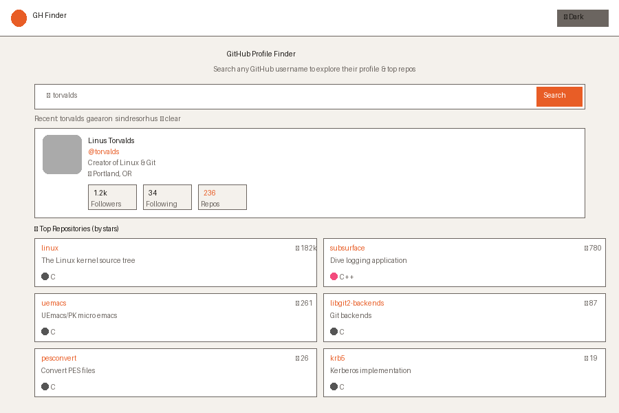
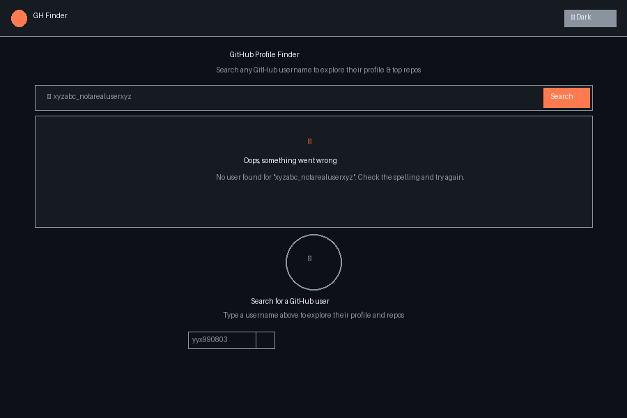

# 🔍 GitHub Profile Finder

A clean, responsive single-page React application that allows users to search any GitHub username and view their profile details and top repositories — built using the GitHub Public REST API.

---

## 📸 Screenshots

### ✅ Success State — Profile Found


> Displays avatar, name, bio, location, followers/following, public repo count, and top 6 starred repositories.

### ❌ Error / Empty State


> Shows a friendly error message when a user is not found or the API rate limit is reached. Also shows the idle empty state before any search is made.

---

## 🚀 Project Setup

### Prerequisites
- Node.js v16 or higher
- npm v7 or higher

### Installation & Run

```bash
# 1. Clone the repository
git clone https://github.com/YOUR_USERNAME/github-profile-finder.git

# 2. Navigate into the project
cd github-profile-finder

# 3. Install dependencies
npm install

# 4. Start the development server
npm run dev
```

Open [http://localhost:5173](http://localhost:5173) in your browser.

### Build for Production

```bash
npm run build
npm run preview
```

---

## 🛠 Technologies Used

| Technology | Purpose |
|---|---|
| **React 18** | UI framework — components, hooks, state |
| **Vite** | Lightning-fast dev server & build tool |
| **Tailwind CSS** | Utility-first responsive styling |
| **JavaScript (ES2022)** | Application logic |
| **GitHub REST API** | User data & repositories (no API key needed) |
| **localStorage** | Persisting theme preference & search history |

---

## 📁 Folder Structure

```
github-profile-finder/
├── index.html                   # HTML entry point
├── package.json
├── vite.config.js
├── tailwind.config.js
├── postcss.config.js
├── README.md
└── src/
    ├── index.js                 # React DOM entry point
    ├── App.jsx                  # Root component — state orchestration
    ├── index.css                # Tailwind directives + global styles
    ├── components/
    │   ├── SearchBar.jsx        # Search input with 300ms debounce
    │   ├── ProfileCard.jsx      # User avatar, bio, stats, location
    │   ├── RepoCard.jsx         # Repo name, description, language, stars
    │   ├── Loader.jsx           # Spinner + skeleton shimmer UI
    │   ├── ErrorState.jsx       # Error messages (404, rate limit, network)
    │   └── EmptyState.jsx       # Idle state before any search
    ├── hooks/
    │   └── useGithubUser.js     # Custom hook — fetches user + repos from API
    └── utils/
        ├── storage.js           # localStorage helpers (theme + search history)
        ├── debounce.js          # Pure debounce utility function
        └── langColors.js        # Language name → hex color map (20+ languages)
```

---

## ✅ Features Implemented

### Core Requirements
- [x] **Search Bar** — Input field to search by GitHub username
- [x] **Debounce (300ms)** — Implemented using `useEffect + setTimeout` cleanup — no external library
- [x] **Profile Card** — Displays avatar, name, bio, location, followers, following, public repos count, and a direct link to the GitHub profile
- [x] **Repository List** — Top 6 repositories sorted by star count, showing repo name, description, language badge, and star count
- [x] **Loading State** — Spinner + skeleton shimmer UI during API call
- [x] **Empty State** — Friendly prompt shown before any search is made
- [x] **Error State** — Handles user not found (404), API rate limit (403), and network failures

### Good-to-Have Features
- [x] **Dark / Light Mode Toggle** — Persisted in `localStorage`, applied via Tailwind's `dark` class on `<html>`
- [x] **Search History** — Last 5 searched usernames stored in `localStorage` as clickable chips; duplicates are filtered; clear button included
- [x] **Skeleton Loader UI** — Shimmer animation on profile card and all 6 repo cards while loading
- [x] **Language Color Indicator Dots** — Color-coded dots per language (JavaScript, Python, TypeScript, Go, Rust, and 15+ more)

---

## 🌐 API Endpoints Used

```
GET https://api.github.com/users/{username}
GET https://api.github.com/users/{username}/repos?sort=stars&per_page=6
```

> GitHub's public API allows **60 unauthenticated requests per hour** — no API key required.

---

## 💡 Key Concept: Debounce via useEffect

This project uses the `useEffect` cleanup pattern to debounce the search — a core real-world React pattern:

```js
useEffect(() => {
  if (!value.trim()) return
  const timer = setTimeout(() => {
    onSearch(value.trim())
  }, 300)
  return () => clearTimeout(timer) // cleanup cancels previous timer on each keystroke
}, [value])
```

Every time the input changes, the previous timer is cleared before a new one starts — so the API is only called 300ms after the user **stops** typing.

---

## 📝 Notes

- No backend, no authentication, no routing — intentionally kept simple
- Focus: clean component architecture, custom hook design, graceful API state handling
- Fully responsive — works on mobile, tablet, and desktop
